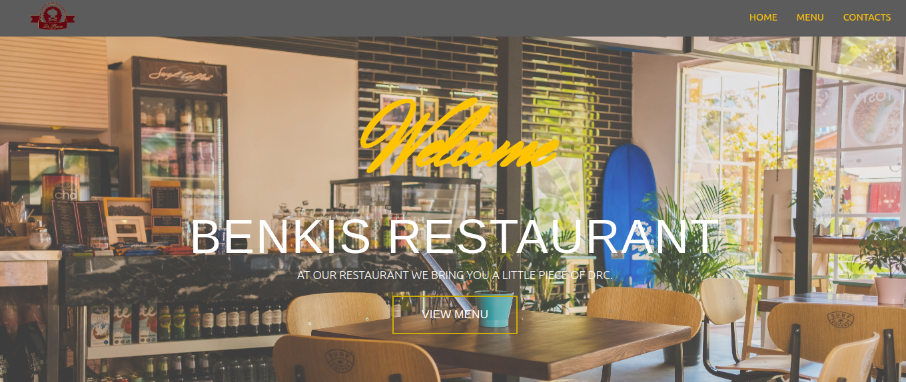

# Benkis Restaurant

> This project I did after the introduction of the React Routingk. The main goal of this project is to show the understanding of the benefits of Routing and how it works with React components.

This website was designed with the tools below:

## Built With

- Javascript
- CSS
- React Js

## Getting Started

**To get the local copy of the project up and running you will need to run the following commands on your terminal:**

`git clone https://github.com/iambenkis/ReactJs-Restaurant-App-.git`

To install all the available dependecies run:
`npm install`

To bundle and transpile the javascript code using webpack run:
`npm run build` for production, or:
`npm run dev` for development.

Now you can open up the index.html file (located in the dist directory in chrome) to see the result.

## Author

👤 **Benjamin Kisenge (Me)**

* GitHub: [@benjamin kisenge](https://github.com/iambenkis)
* Twitter: [@benjamin kisenge](https://twitter.com/iambenkis)
* LinkedIn: [benjamin kisenge](https://www.linkedin.com/in/ben-kisenge/)

## 🤝 Contributing

Contributions, issues, and feature requests are welcome!

Feel free to check the [issues page](https://github.com/iambenkis/ReactJs-Restaurant-App-/issues).

## Show your support

Give a ⭐️ if you like this project!❤️❤️❤️

## Acknowledgments

- Microverse)